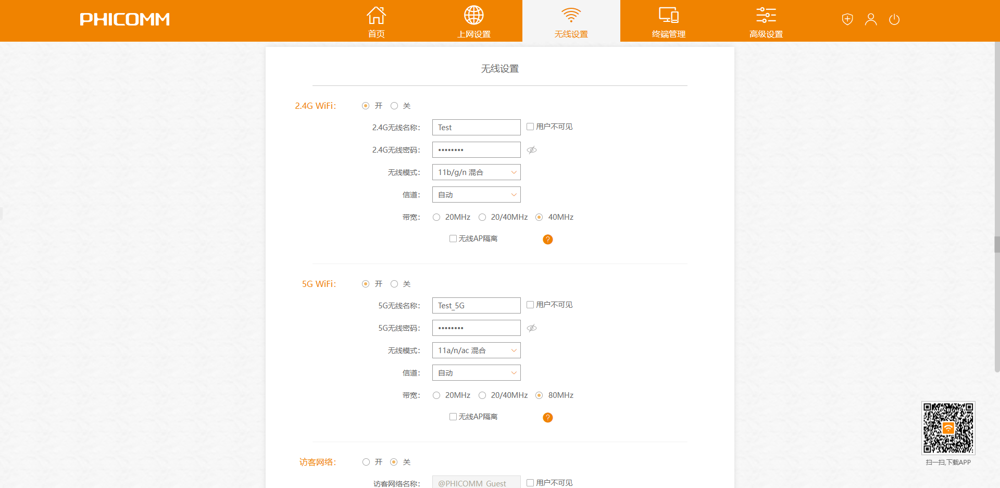

# 山东财经大学燕山学院校园网（Netkeeper）路由器安装教程

## 前言

> ​	NetKeeper给校内上网带来了诸多麻烦，路由器安装是解决问题的较优解，许多贡献者无私奉献了各种解决方案，但有部分缺少[开源精神](https://blog.csdn.net/cping1982/article/details/5044191)者利用他人劳动成果谋取暴利，实在令人汗颜，希望本教程能帮助更多的同学掌握路由器的安装，并打击以此牟利的行为。
>
> ​	**若这篇教程帮助到了你，请传播给更多的人，这是对我工作的最大认可。**
>
> ​	本教程列出了目前可用的两个固件的安装方法（PandoraBox、K2官改固件），并附上了相应固件、软件包，值得注意的是，若你想尝试其他固件，请**尽量避免使用DiyBox固件**。
>
> ​	如遇学校Netkeeper升级等原因导致本教程失效，请在[本项目的Gitee地址](https://gitee.com/cherrycube/yanyuan_netkeeper)下提 Issues。  
>
> ​	
>
> ​	你可以在以下链接下载本文涉及的所有文件：
>
> - 蓝奏云：https://wwda.lanzouy.com/b03252s7i  密码:4vmp
> - Gitee：https://gitee.com/cherrycube/yanyuan_netkeeper

------

## 常见问题及解决方法

本教程列举了作者能想到的所有问题，解决方法其实较简单，不要被劝退了XD

>|                             问题                             |                           解决方法                           |
>| :----------------------------------------------------------: | :----------------------------------------------------------: |
>|                         拨号显示691                          |            放轻松，这正是拨号拦截正常运行的表现:)            |
>| 安装 NetKeeper（拨号软件）后右下角 Wifi 按钮消失、拨号显示错误118 | NetKeeper软件问题，双击打开 [修复NetKeeper118.reg] ，点“是”后重启 |
>| 路由器正常使用一段时间后断网，重启路由器拨号正常拦截，但没有网络 | 大概率是账号上线状态卡了，使用有网络的设备，浏览器打开 http://223.99.141.139:1000/ ，登录后将账号强制下线，重启路由器并拨号 |
>|                         拨号显示651                          | 大概率是路由器还没有启动好，等待能进路由器后台后重新拨号；如果是自行配置的（参照其他安装教程），也有可能是路由器 OPPOE 服务器脚本没安装好；小概率原因是学校网络崩了 |
>|            部分设备（尤其是苹果设备）搜不到5G信号            | 5G WIFI 信道问题，可以尝试改为149信道或其他信道试试（具体请[百度](https://www.zhihu.com/question/393775872)） |
>|                       路由器后台进不去                       | 检查有线 / 无线连接，使用微软Edge / 谷歌Chrome / FireFox 浏览器，确保地址输入正确（官改固件后台为[192.168.2.1](http://192.168.2.1)，OpenWrt / PandoraBox 一般为[192.168.1.1](http://192.168.1.1)，可使用 [Cmd](https://jingyan.baidu.com/article/b2c186c8bc12c0846ef6ff86.html) 输入 ipconfig 并回车查看[后台地址](https://post.smzdm.com/p/ax0860zw/)） |

------

## 硬件需求

>- 斐讯K2路由器**（带Breed，参考价50元）** or 斐讯K2P路由器**（仅有Pandorabox破解固件，未实验过是否可用，需要Breed）**
>
>   **购买路由器时如果不确定是否自带 Breed，请询问客服是否自带 Breed 或能否代刷 Breed，购物软件可能屏蔽“斐讯”二字，搜索路由器请使用“斐K2” / “K2路由器” 等关键词。**
>
>- 一根网线**（刷固件必须）**
>

## 安装方法（二选一）

### 1.Pandorabox破解固件（优先）

基于 Pandorabox 的 Netkeeper 破解，优点是兼容性强、稳定，缺点是速度可能稍慢、有时有小问题需要自行解决。

> **操作步骤：**
>
> ① WAN口不插网线，用一根网线将电脑与路由器任意 LAN 口链接，**按住重置键后插入电源（插入电源前就应按住重置键）**，此时不要松开重置按键，维持约10秒。
>
> 
>
> 
>
> 
>
> ② 电脑不要链接 WIFI ，确保电脑与路由器已用网线连接，打开浏览器，输入 [192.168.1.1](http://192.168.1.1) ，此时你应该看到如下页面：
>
> 
>
> 
>
> <center> Breed界面，系统信息有区别为正常现象 </center>
>
> <br></br>
>
> ​	如果你没有看到这个这个界面，可能的部分原因是：
>
> ​	1. 路由器没有刷 Breed，换刷了 Breed 的路由器或是自己尝试刷入
>
> ​	2. 电脑没断WIFI
>
> ​	3. 网线没有连接好 / 网线坏了 / 路由器当前连接的 LAN 口坏了
>
> ​	4. 按重置键的时间太短了/ 没按住重置键就插上了电源
>
> ​	5. 网站输错了 / 浏览器问题（建议用 微软Edge / 谷歌Chrome / FireFox）
>
> ​	检查以上问题，直到能进入 Breed 界面
>
> 
>
> ③ 建议备份编译器固件和EEPROM，这是路由器“救砖”的重要数据。
>
> 
>
> 
>
> 
>
> ④ 点击左侧 **固件更新**，点击固件右侧的 **选择文件**，选择 1-已配置好的固件 文件夹下的 [k2_yanyuan_pandorabox.bin] ，内存布局选择公版，勾选自动重启，点击 **上传** **（闪存布局一定选择公版！不然路由器很可能变砖！）**
>
> 
>
> 
>
> 
>
> <br></br>
>
> ⑤ 点击 **上传** ，确定信息无误后点击 **更新** ，等待进度条走完。
>
> 
>
> 
>
> 
>
> 
>
> <br></br>
>
> 
>
> ⑥ 当你看到如下信息，证明固件成功更新，设备重启进入初始化阶段，这个阶段时间稍长，可以先泡杯茶~
>
> 
>
> 
>
> 
>
> ⑦ 等待路由器初始化完毕，打开浏览器，输入[192.168.1.1](http://192.168.1.1)，此时你应该看到如下页面：
>
> 
>
> ​	<font color=#ff0000 size='5'><big>管理员密码：**admin** 输入后点击登录。</big></font>
>
> 
>
> ⑧ 进入管理页面后点击 **网络 → 无线** ，分别修改2.4G和5G无线名称、密码。
>
> ```
> 2.4G WiFi优点：2.4G信号频率低，在空气或障碍物中传播时衰减较小，传播距离更远；
> 2.4G WiFi缺点：目前大多数设备多使用2.4G频段，用户较多的地方，干扰较大。
> 5G WiFi优点：5G信号频宽较宽，干扰少，网速稳定，并且可以支持更高的无线速率。
> 5G WiFi缺点：5G信号频率较高，传播时衰减较大，覆盖距离一般比2.4G信号小。
> ```
>
> 
>
> 
>
> 
>
> 
>
> 
>
> 
>
> 
>
> ⑨ 点击 **系统** ，点击 **同步浏览器时间** 。
>
> 
>
> 
>
> ⑩ 将 **网线主线** 连接至路由器 WAN 口，楼梯下一般有五根网线，其中一根是主线，四根是连至各床铺的网线，判断线是否是主线的方法如下：
>
> - 主线一般与其他线有一定区别，包括但不限于：长得和其他线不一样 / 比其他线长或短 / 和其余四根线距离较远
> - 如果不确定某根网线是不是主线，可以把网线直接与电脑连接，能正常拨号上网的即是主线
>
> ⑪ 点击 **系统 → 重启** ，点击 **执行重启** ，等待重启成功后打开Netkeeper拨号软件，输入账号密码进行拨号，如一切顺利会出现错误691字样：
>
> 
>
> 
>
> **放轻松，这正是拨号拦截正常运行的表现**，此时若打开 WAN 口配置也可看到路由器成功拦截到了账号密码：
>
> 
>
> 
>
> 
>
> <font color=#ff0000 size='5'>静等几秒，你应该能够成功联网，此后如果路由器断网，重复步骤11即可恢复，拨号时无需有线连接，无线连接也可正常拦截。</font>

### 2.原版改版固件

基于，优点是功能简便，易于安装，缺点是有时会抽风。

> **操作步骤：**
>
> ① 刷入固件，流程与PandoraBox相同，固件为 [k2_yanyuan_guangai.bin]。
>
> 
>
> ② 等待路由器重启后，打开浏览器，输入[192.168.2.1](http://192.168.2.1)，此时你应该看到如下页面：
>
> 
>
> 
>
> ​	<font color=#ff0000 size='5'><big>管理员密码：**admin** 输入后点击登录。</big></font>
>
> 
>
> ③ 登录后点击 **无线设置** ，将2.4G、5G无线名称、无线密码更改，下滑点击 **保存** ，等待路由器更改完毕。
>
> 
>
> 
>
> 
>
> ④ 更改完毕后，点击 **高级设置 → 系统状态 → 同步** 以同步时间，然后点击右上角电源图标，点击 **立即重启路由器** ，等待路由器重启完毕。
>
> 
>
> 
>
> 
>
> ⑤ 将 **网线主线** 连接至路由器 WAN 口，楼梯下一般有五根网线，其中一根是主线，四根是连至各床铺的网线，判断线是否是主线的方法如下：
>
> - 主线一般与其他线有一定区别，包括但不限于：长得和其他线不一样 / 比其他线长或短 / 和其余四根线距离较远
> - 如果不确定某根网线是不是主线，可以把网线直接与电脑连接，能正常拨号上网的即是主线
>
> ⑥ 点击 **系统 → 重启** ，点击 **执行重启** ，等待重启成功后打开Netkeeper拨号软件，输入账号密码进行拨号，如一切顺利会出现错误691字样：
>
> 
>
> 
>
> **放轻松，这正是拨号拦截正常运行的表现**，此时若打开 WAN 口配置也可看到路由器成功拦截到了账号密码：
>
> 
>
> 
>
> <font color=#ff0000 size='5'>静等几秒，你应该能够成功联网，此后如果路由器断网，重复步骤4即可恢复，拨号时无需有线连接，无线连接也可正常拦截。</font>

## 断网通用检修流程

由于网络波动等原因，路由器免不了掉线，若遇到疑难问题请根据下方流程检修。

> |                      检修流程                      |
> | :------------------------------------------------: |
> | 重启路由器，重新拨号，检查是否恢复（普通重启拨号） |
> |  将主网线与电脑直接链接，检查是否有网，如果没有网  |
> |             重新安装固件，尝试是否恢复             |
> |                      更换固件                      |
>
> 实在解决不了可以在[本项目的Gitee地址](https://gitee.com/cherrycube/yanyuan_netkeeper)下提 Issues，提问务必把情况说明，不然作者难以帮忙。

## 参考文档（点击跳转）

>**以下文档大多有完整的安装教程，想重头自己尝试安装的可以参考一下**
>
>1.Breed安装教程1：[都2022年了，再谈路由器刷机【K1/K2/K2P系列刷机图文教程】](https://post.smzdm.com/p/aoxnvzen/)
>
>*如果你不慎买了未提前刷好Breed的路由器，可以尝试自行刷Breed*
>
>2.Pandorabox破解固件: [高校 校园网 重庆 创翼 netkeeper PPPOE拦截 拨号拦截](https://github.com/goodwinY/netkeeper)
>
>3.[[C/C++] Run Netkeeper on OpenWrt Device](https://github.com/huipengly/Openwrt-NetKeeper)
>
>4.[k2官改安装截获插件破解netkeeper4.0教程](http://www.gocloud.cn/bbs/thread-901-1-1.html)
>
>5.[Pandora-K2-Netkeeper](https://github.com/Senkeller/PandoraBox-k2-netkeeper)